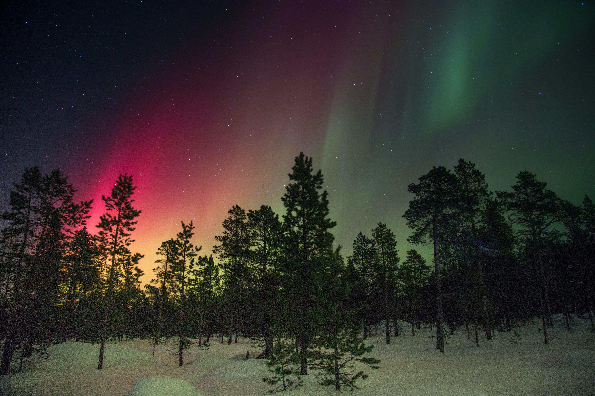

<h1 align="center">Welcome to Borealis Theme 👋</h1>

  
  

> The theme is designed to be easy on the eyes thus reducing the eye strain.
> The aurora borealis served as the inspiration for this theme, with it's teal like colors, mixed with violets, pink, greens, and the dark of the night sky in Alaska.

## Install

All instructions can be found in each theme's repository.

## Color Palette

| Color             | Hex Code                                                                 |
| ----------------- | ------------------------------------------------------------------------ |
| Black             |  `#000000`       |
| Black             |  `#00000026` |
| Transparent Black |  `#00000000` |
| Mexican Red       |  `#a22929`       |
| Silver Chalice    |  `#aaaaaa`       |
| White             |  `#ffffff`       |
| White             |  `#ffffff00` |
| White             |  `#ffffff1a` |
| White             |  `#ffffff21` |
| White             |  `#ffffff33` |
| Silver            |  `#cccccc`       |
| Flamingo          |  `#f44542`       |
| Blaze Orange      |  `#ff7200`       |
| Blaze Orange      |  `#ff720066` |
| Meteor            |  `#c97d0c`       |
| Orange Peel       |  `#ff9d00`       |
| Golden Tainoi     |  `#ffd259`       |
| Candlelight       |  `#ffde11`       |
| Candlelight       |  `#ffde1133` |
| Candlelight       |  `#ffde1155` |
| Candlelight       |  `#ffde1180` |
| Kournikova        |  `#ffee80`       |
| Bitter Lemon      |  `#d6e11066` |
| Mint Green        |  `#92fc79`       |
| Mint Green        |  `#a5ff90`       |
| Chateau Green     |  `#3c9f4a`       |
| Amazon            |  `#2f7344`       |
| Malachite         |  `#0ae352`       |
| Malachite         |  `#0ae35233` |
| Aquamarine        |  `#80ffbb`       |
| Eden              |  `#0d5851`       |
| Observatory       |  `#02877b`       |
| Paradiso          |  `#266d67`       |
| Timber Green      |  `#152d2b`       |
| Blue Dianne       |  `#194945`       |
| Blue Dianne       |  `#19494500` |
| Eucalyptus        |  `#236d67`       |
| Green Pea         |  `#1f625d`       |
| Green Pea         |  `#1f625d80` |
| William           |  `#3b6461`       |
| William           |  `#3b646133` |
| Faded Jade        |  `#407975cc` |
| Plantation        |  `#24514e`       |
| William           |  `#356663cc` |
| Firefly           |  `#123836`       |
| Firefly           |  `#12383666` |
| Firefly           |  `#12383699` |
| Anakiwa           |  `#9effff`       |
| Cyan / Aqua       |  `#02fcff`       |
| Persian Green     |  `#00a2a4`       |
| Persian Green     |  `#00a2a480` |
| Eastern Blue      |  `#189094`       |
| Baby Blue         |  `#e1feff`       |
| Blue Lagoon       |  `#00818b`       |
| Rolling Stone     |  `#747576`       |
| Mauve             |  `#fb94ff`       |
| Brink Pink        |  `#ff628c`       |
| Amaranth          |  `#ee3a4333` |
| Amaranth          |  `#ee3a4355` |

## Author

👤 **eckertalex**

- Github: [@eckertalex](https://github.com/eckertalex)
- Twitter: [@eckertalex\_](https://twitter.com/eckertalex_)

## Show your support

Give a ⭐️ if this project helped you!

## 📝 License

Copyright &copy; 2020 [eckertalex](https://github.com/eckertalex).  This project is
[MIT](https://github.com/eckertalex/borealis-theme/blob/main/LICENSE) licensed.

---

_The base of this README was generated with ❤️ by
[readme-md-generator](https://github.com/kefranabg/readme-md-generator)_
